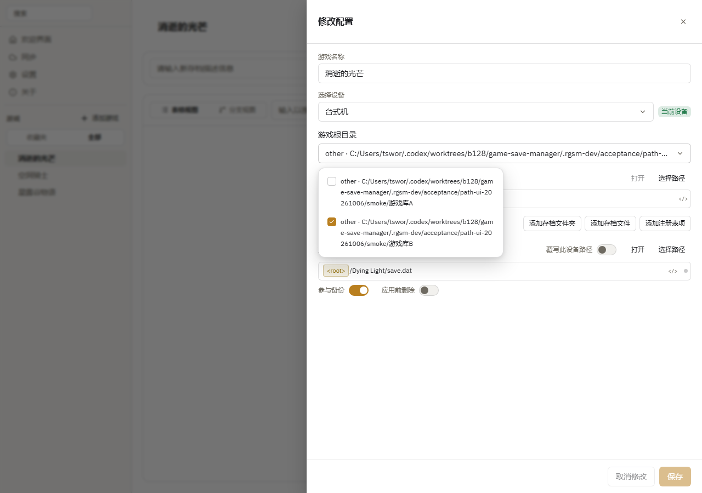
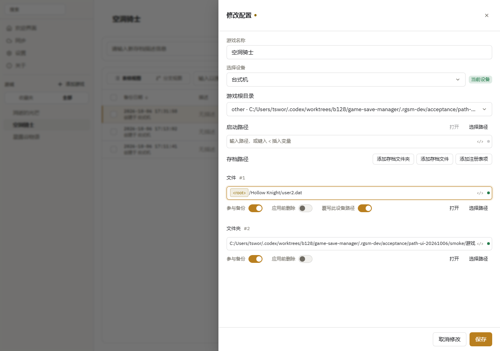

# Save locations and path variables

## Edit save locations

1. Open a game and click **View managed files**.
2. Select a device, then edit save locations or add entries.
3. Click **Save**.

Files, folders, and Windows registry entries are supported. Enable **Delete before overwrite** when you want a folder cleared before its contents are restored.

## Use path variables

Type `<` in a path field and choose a suggested variable. The field shows the resolved path on this device.

For example, `<home>/Saved Games/MyGame` uses the current user's home folder.

Detected dynamic paths match files on the current device. Add game library folders and installation locations in **Settings → Auto Scan**.

## Choosing between game libraries

`<root>` is a game library root. The relative path after it is appended as written. For a game at `H:\Dying Light\DyingLightGame.exe` with library root `H:\`, use `<root>/Dying Light/DyingLightGame.exe` as the launch path.

When several locations are available, select the library in the add or import dialog. For an existing game, use **View managed files → Game root directory**. A single candidate is used automatically. File existence does not decide which library to use.

The selection is saved with the paths for this game and this device. Another device can use a different library while keeping the same relative path. Launch paths require one location; dynamic save patterns can explicitly select several libraries or accounts.

View the resolved path below the input or hover over its status dot. If it says “Select a location”, choose one first. If the file does not exist, check the path or run the game to create a save before backing up. You can also pick the actual file or folder directly.

## Device paths

If a device stores saves outside the original dynamic pattern, set an override:

1. Open **View managed files** and select the device.
2. Turn on **Override path on this device** on the dynamic save entry and enter its actual path.
3. Click **save**. To revert, turn off **Override path on this device** and save again.

The override affects only the selected device and preserves the original pattern. Backup, restore, and automatic backup use the override. A missing override causes backup to fail without falling back to another location; restoring can create a missing target.

An override changes only the path, preserving the file or folder type. Multiple captured locations for one save entry cannot be merged into a single override location.

Name your devices in **Settings → Device Management**. To reuse another device's paths, click its **Import Paths** action. Confirming replaces the corresponding path settings on this device.

## Typed paths, globs, and device variables

**Add save file / folder** appends an editable row. Use **Choose path** on its right to open a picker. Typed paths, dynamic paths, and device overrides share the same expression syntax.

A glob such as `D:/Saves/*/SaveGames` captures every matching directory and preserves their relative locations. It does not identify different directories as the same logical save. Opening a glob opens its containing root.

Configure **Path variables** while adding or editing a game, then reference them as `<var:name>`, for example `<var:saveRoot>/MyGame/<var:account>/*.sav`.

- Editing a value changes only this game on the current device. Each field shows its value source.
- Choose **Edit device variable…** from the variable's **⋯** menu to review affected games and edit the shared value. Existing game overrides are preserved.
- **Use device variable** clears a game override; **Discard default change** discards only the pending shared edit.
- Cancel discards edits; Save persists the variables and game together.

Set the same variable names to the appropriate values on another device. Restore uses the target device's values while retaining distinct glob matches. Values are literal text or paths; nested variables and scripts are unsupported, and glob characters inside values are treated literally. Referenced variables must have values.

Variables after a glob require Archive V5 relocation metadata in new backups. These backups require a V5-capable application to restore. Existing archives remain readable, but old directory names are not automatically interpreted as variables.

Choose **Insert variable** beside a path to select a variable or create and insert one by name and value. You do not need to type `var:`. Device variables are shared on this device; game variables apply only to this game on this device. If another device lacks a value, choose **Set up variables** on the game page. Backup and restore also open setup when needed: **Save and continue** resumes the requested operation, while closing cancels it.

Choose **Find local location** beside a variable to search for values matching the save path. Selecting a result updates only this game’s draft; save the game to apply it. Confirm the candidate even when only one is found. Configure other missing variables, such as the root directory, first. If no location matches, enter a value manually. Search is bounded, reports incomplete results, and does not follow symbolic links.
